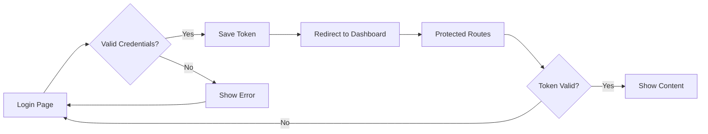

# 🛵 QuickDrop Web - Login System

> A beautiful, secure, and production-ready authentication system for QuickDrop admin dashboard.


---

## ✨ Features

- 🎨 **Pixel-perfect design** with exact color specifications
- 🔐 **JWT authentication** with persistent sessions
- 🛡️ **Protected routes** with role-based access control
- ⚡ **Fast & responsive** built with Vite + React
- 🎭 **Beautiful UI** with custom fonts (Syne + JetBrains Mono)
- 📱 **Mobile-friendly** responsive design
- 🔄 **Loading states** with smooth animations
- ❌ **Error handling** with clear user feedback
- 🚪 **Logout functionality** with session cleanup
- 👤 **User info display** in sidebar

---

## 🚀 Quick Start

```bash
# Navigate to project
cd d:\QuickDrop\quickdrop-web

# Install dependencies
npm install

# Start development server
npm run dev

# Or use the batch file
start.bat
```

Open browser: **http://localhost:5173/login**

---

## 🔑 Test Credentials

```
Admin:
Email: admin@quickdrop.com
Password: admin123

Store Manager:
Email: manager@quickdrop.com
Password: manager123
```

---

## 🎨 Design System

### Colors
```css
Background: #080810  /* Dark Navy */
Card:       #12121f  /* Darker Navy */
Border:     #1c1c2e  /* Navy Gray */
Accent:     #FF5C28  /* Vibrant Orange */
Text:       #E8E8F5  /* Light Gray */
Muted:      #6B6B8A  /* Muted Purple */
```

### Typography
- **Syne** - Headings, buttons, logo
- **JetBrains Mono** - Inputs, labels, monospace text

---

## 📂 Project Structure

```
src/
├── context/
│   └── AuthContext.tsx          # Auth logic & useAuth hook
├── components/
│   ├── ProtectedRoute.tsx       # Route protection
│   └── Sidebar.tsx              # Sidebar with logout
├── pages/
│   ├── Login.tsx                # Login page ⭐
│   ├── Unauthorized.tsx         # Access denied
│   ├── Dashboard.tsx            # Protected
│   ├── Orders.tsx               # Protected
│   ├── Store.tsx                # Protected
│   └── Fleet.tsx                # Protected
└── App.tsx                      # Main app with routing
```

---

## 🔐 Authentication Flow



---

## 🛠️ API Integration

### Endpoint
```
POST https://quickdrop-api.vercel.app/api/auth/signin
```

### Request
```json
{
  "email": "admin@quickdrop.com",
  "password": "admin123"
}
```

### Response
```json
{
  "token": "eyJhbGciOiJIUzI1NiIsInR5cCI6IkpXVCJ9...",
  "user": {
    "id": "1",
    "name": "Admin User",
    "email": "admin@quickdrop.com",
    "role": "admin"
  }
}
```

### Token Storage
- Saved to `localStorage` as `qd_token`
- Auto-loaded on app mount
- Removed on logout

---

## 🎯 Usage Examples

### Using the Auth Hook

```typescript
import { useAuth } from './context/AuthContext';

function MyComponent() {
  const { user, token, login, logout, isLoading, error } = useAuth();
  
  // Login
  const handleLogin = async () => {
    try {
      await login('admin@quickdrop.com', 'admin123');
      // Success! User is now logged in
    } catch (err) {
      // Error is available in the 'error' state
    }
  };
  
  // Logout
  const handleLogout = () => {
    logout();
    // User is now logged out
  };
  
  return (
    <div>
      {user ? (
        <p>Welcome, {user.name}!</p>
      ) : (
        <button onClick={handleLogin}>Login</button>
      )}
    </div>
  );
}
```

### Protecting a Route

```typescript
import ProtectedRoute from './components/ProtectedRoute';

<Route
  path="/admin"
  element={
    <ProtectedRoute allowedRoles={['admin']}>
      <AdminPage />
    </ProtectedRoute>
  }
/>
```

---

## 📱 Pages & Routes

| Route            | Access      | Description              |
|------------------|-------------|--------------------------|
| `/login`         | Public      | Login page               |
| `/unauthorized`  | Public      | Access denied page       |
| `/dashboard`     | Protected   | Main dashboard           |
| `/orders`        | Protected   | Orders management        |
| `/store`         | Protected   | Store management         |
| `/fleet`         | Protected   | Fleet management         |

**Protected routes require:**
- Valid JWT token
- Role: `admin` or `store_manager`

---

## 🎨 UI Components

### Login Page
- Centered card layout
- 🛵 QuickDrop logo in orange
- "Welcome back" heading
- Email & password inputs
- Full-width orange button
- Loading spinner
- Error messages
- Responsive design

### Sidebar
- Logo & branding
- User info display
- Navigation menu
- Active route highlighting
- Logout button
- Version info

### Protected Routes
- Auto-redirect to login
- Role-based access
- Unauthorized page

---

## 🔧 Configuration

### Change API Endpoint

Edit `src/context/AuthContext.tsx`:

```typescript
const response = await fetch('YOUR_API_URL/api/auth/signin', {
  method: 'POST',
  headers: { 'Content-Type': 'application/json' },
  body: JSON.stringify({ email, password }),
});
```

### Add New Protected Route

Edit `src/App.tsx`:

```typescript
<Route path="/new-page" element={<NewPage />} />
```

### Modify Allowed Roles

Edit `src/App.tsx`:

```typescript
<ProtectedRoute allowedRoles={['admin', 'store_manager', 'new_role']}>
  {/* ... */}
</ProtectedRoute>
```

---

## 🐛 Troubleshooting

### Login fails
- ✅ Check API endpoint is accessible
- ✅ Verify credentials are correct
- ✅ Check network tab in DevTools
- ✅ Ensure CORS is configured

### Token not persisting
- ✅ Check localStorage in DevTools
- ✅ Look for `qd_token` key
- ✅ Verify token format is valid JWT

### Protected routes not working
- ✅ Ensure token exists in localStorage
- ✅ Check user role matches allowed roles
- ✅ Verify ProtectedRoute is wrapping routes

### Fonts not loading
- ✅ Check internet connection
- ✅ Verify Google Fonts CDN is accessible
- ✅ Check browser console for errors

---

## 📚 Documentation

- **[QUICK_START_GUIDE.md](./QUICK_START_GUIDE.md)** - Get started in 3 steps
- **[LOGIN_IMPLEMENTATION.md](./LOGIN_IMPLEMENTATION.md)** - Full implementation details
- **[COMPLETE_CODE_SUMMARY.md](./COMPLETE_CODE_SUMMARY.md)** - All code in one place
- **[VISUAL_PREVIEW.md](./VISUAL_PREVIEW.md)** - Visual design reference

---

## 🧪 Testing

### Manual Testing Checklist

**Login Page:**
- [ ] Page loads correctly
- [ ] Can enter email and password
- [ ] Login button works
- [ ] Loading spinner shows during login
- [ ] Error message displays on failure
- [ ] Redirects to dashboard on success

**Protected Routes:**
- [ ] Cannot access without login
- [ ] Redirects to login when not authenticated
- [ ] Can access after successful login
- [ ] Sidebar shows user information
- [ ] Logout button works

**Responsive Design:**
- [ ] Works on mobile devices
- [ ] Works on tablets
- [ ] Works on desktop

---

## 🚀 Deployment

### Build for Production

```bash
npm run build
```

Output: `dist/` folder

### Deploy to Vercel

```bash
# Install Vercel CLI
npm i -g vercel

# Deploy
vercel
```

### Environment Variables

No environment variables needed! API endpoint is hardcoded.

To use environment variables:

1. Create `.env`:
```env
VITE_API_URL=https://quickdrop-api.vercel.app
```

2. Update `AuthContext.tsx`:
```typescript
const API_URL = import.meta.env.VITE_API_URL;
```

---

## 🔒 Security Considerations

### Current Implementation
✅ JWT token authentication
✅ Role-based access control
✅ Protected routes
✅ Secure logout

### Production Recommendations
- Use httpOnly cookies instead of localStorage
- Implement token refresh mechanism
- Add CSRF protection
- Use HTTPS only
- Implement rate limiting
- Add 2FA for admin accounts
- Log authentication attempts
- Set token expiration

---

## 📦 Dependencies

```json
{
  "react": "^18.2.0",
  "react-dom": "^18.2.0",
  "react-router-dom": "^6.21.1",
  "@tanstack/react-query": "^5.17.19",
  "lucide-react": "^0.309.0",
  "typescript": "^5.3.3",
  "vite": "^5.0.11",
  "tailwindcss": "^3.4.1"
}
```

---

## 🎉 What's Included

✅ Complete authentication system
✅ Beautiful login page
✅ Protected routes
✅ Role-based access control
✅ useAuth hook
✅ ProtectedRoute component
✅ Logout functionality
✅ User info display
✅ Loading states
✅ Error handling
✅ Responsive design
✅ Custom fonts
✅ Exact color scheme
✅ Smooth animations
✅ Production-ready code
✅ Full documentation

---

## 📝 License

This project is part of QuickDrop delivery platform.

---

## 🤝 Support

For issues or questions:
1. Check the documentation files
2. Review the code comments
3. Test with provided credentials
4. Verify API endpoint accessibility

---

## 🎯 Next Steps

1. **Run the app**: `npm run dev`
2. **Test login**: Use provided credentials
3. **Explore dashboard**: Navigate through protected routes
4. **Customize**: Modify colors, fonts, or add features
5. **Deploy**: Build and deploy to production

---

**Built with ❤️ for QuickDrop**

🛵 Fast. Secure. Beautiful.
